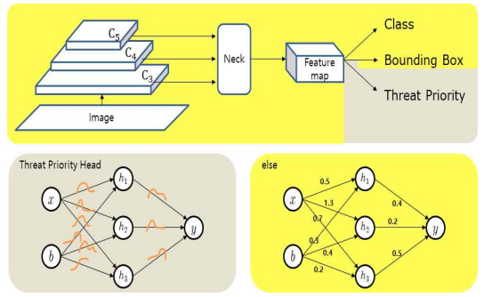
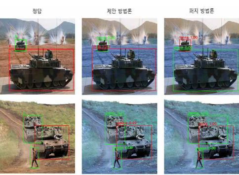

# 🪖 Threat Priority Estimation with Uncertainty for Unmanned Tanks

불확실성 추정을 포함한 무인전차용 위협 우선순위 판단 알고리즘  
Yonsei University 

Object Detection → Threat Ranking → Uncertainty Estimation (End-to-End)


## Overview

본 프로젝트는 **무인전차(Unmanned Tank)**의 자율 교전 능력을 향상시키기 위해, 다수의 적 객체가 탐지된 상황에서 **가장 위협적인 표적을 실시간으로 판단**하는 **위협 우선순위 판단 알고리즘**을 제안

기존 무인지상차량(UGV) 연구는 객체 탐지나 자율주행에 집중되어 있었으며, 실제 교전 상황에서 요구되는 **위협 판단(threat assessment)**과 **예측 신뢰도(uncertainty)**를 함께 고려한 연구는 부족

이에 본 연구는  
- 객체 탐지 모델(YOLOv10)에  
- **Threat Priority Head**를 추가하고  
- **부분 베이지안 신경망(Partially Bayesian Neural Network, PBNN)**을 도입 

=> 정확도와 판단의 신뢰성까지 고려 

[아키텍쳐]


[결과 예시]



## Motivation

### Autonomous Weapon Systems의 한계

- 객체 탐지는 가능하지만  
  → **어떤 표적을 먼저 대응해야 하는지 판단 불가**
- 딥러닝 모델의 **과잉확신(Over-Confidence)** 문제
- 예측이 틀렸을 때도 **항상 높은 confidence 출력**

### 문제 인식

- 전장 상황에서는 *정확한 예측*보다  
  **“신뢰 가능한 예측”**이 더 중요
- AI 판단에 대한 **불확실성 정보 제공 필요**
- 실시간 추론 환경을 고려한 **경량 구조 필요**


## Proposed Method

### Overall Pipeline
```
Input Image
↓
YOLOv10 Backbone
↓
Object Detection (Class / Bounding Box)
↓
Threat Priority Head
↓
Priority Score + Uncertainty (Mean / Variance)
```

---

## Model Architecture

### Base Model

- **YOLOv10**
  - One-to-Many + One-to-One Dual Assignment
  - NMS-free inference
  - Light architecture

### Added Component: Threat Priority Head

- 객체별 **위협 수준(score)** 예측
- 기존 클래스 분류와 독립적으로 동작
- 교전 우선순위 판단에 사용

---

## Partially Bayesian Neural Network (PBNN)

### Core Idea

- 전체 네트워크가 아닌  
  **Threat Priority Head에만 Bayesian 적용**
- 나머지 네트워크는 Deterministic 유지
(계산 복잡성 줄임)

### Inference Strategy

- 동일 입력에 대해 **K회 반복 추론**
- 출력:
  - **Mean** → 최종 위협 점수
  - **Variance** → 예측 불확실성

### Advantages

- Full BNN 대비
  - 추론 속도 대폭 개선
  - 계산 비용 절감
- 실시간 시스템에 적용 가능

## System Characteristics

- Object Detection + Threat Assessment 통합
- Uncertainty-aware Decision Making
- Real-time Inference 가능
- Autonomous Weapon System 적용 가능
